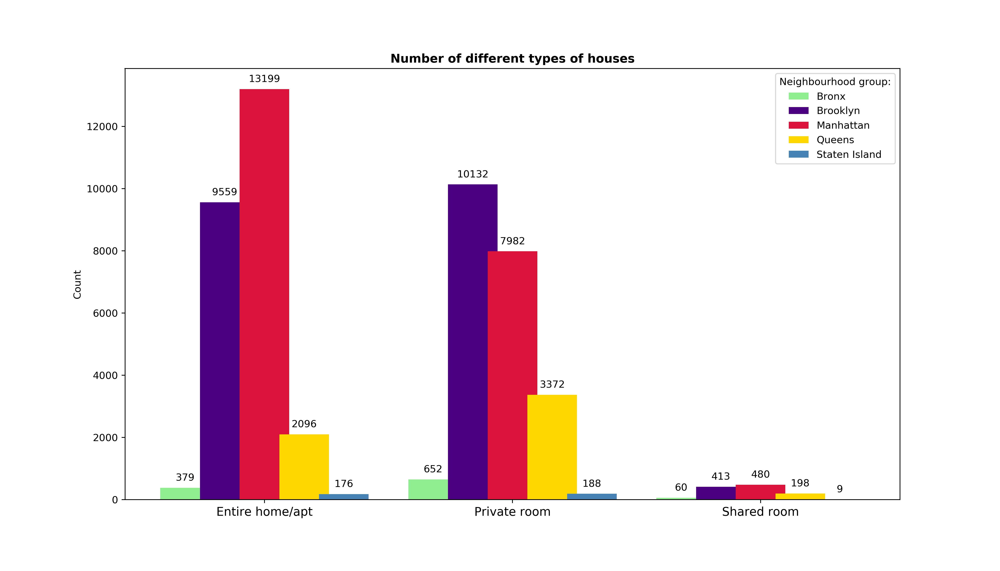
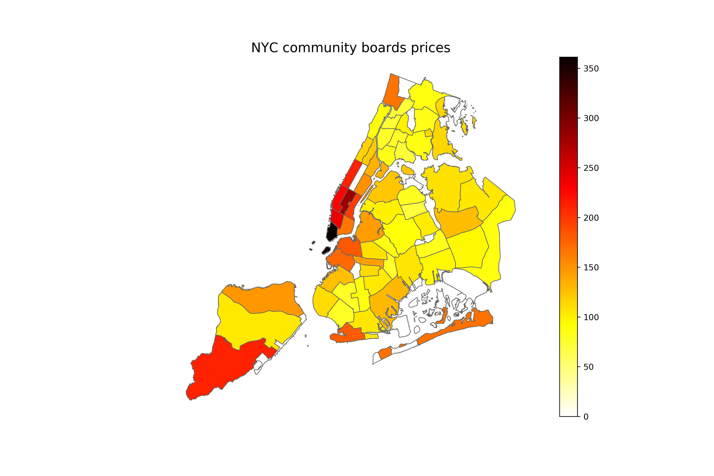

# NYC_airbnb

## Table of Contents
* [General info](#general-info)
* [Screenshots](#screenshots)
* [Technologies](#technologies)
* [Libraries](#libraries)
* [Status](#status)
* [Sources](#sources)
* [Contact](#contact)

## General info
This Python script contains analysis of NYC airbnb dataset. Apart from analysis and visualisation, I made simple web scraping with BeautifulSoup module.
Tasks:

1. In which region are the highest listing prices?

2. What is the range of prices in each neighbourhood group?

3. What is the number of different types of houses in each neighbour group?

4. What is the distribution of house types in NYC area?

## Screenshots
Sample drawings:

## Technologies
* Python 3.7.4

## Libraries
* Python: os, numpy, matplotlib, seaborn, pandas, geopandas, requests, bs4, csv

## Status
Project is: _finished_

## Sources
Dataset comes from: https://www.kaggle.com/dgomonov/new-york-city-airbnb-open-data

Web scraping from: https://en.wikipedia.org/wiki/Neighborhoods_in_New_York_City

## Contact
maciej.wilk04@gmail.com
